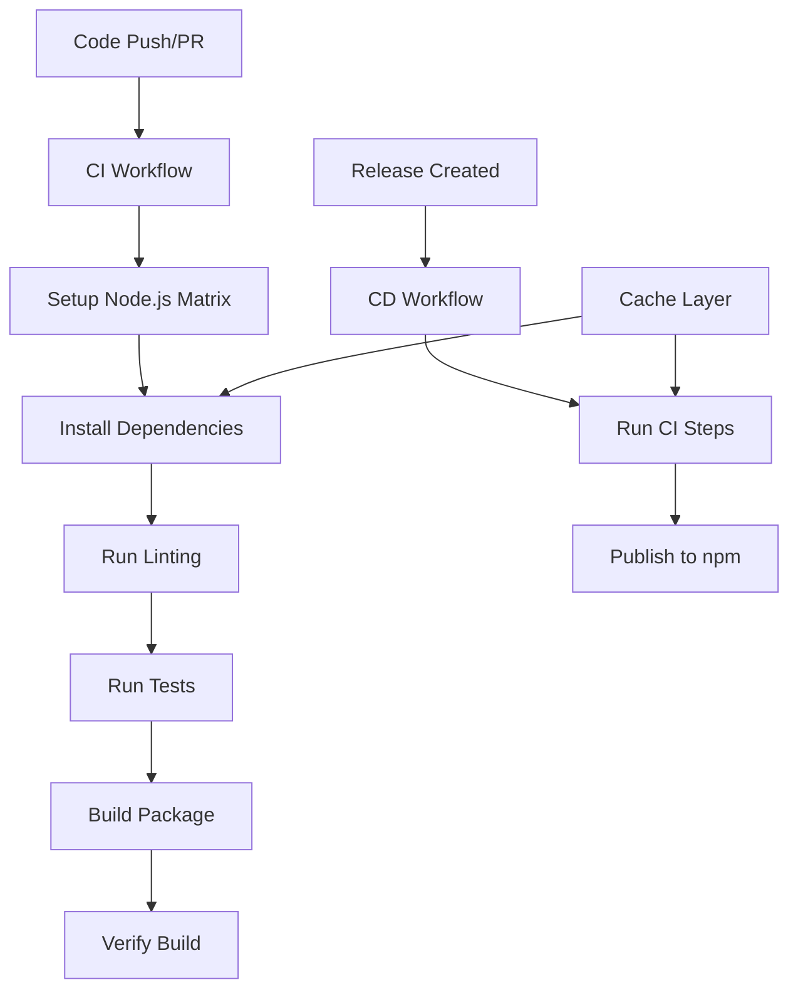

# Design Document

## Overview

This design implements a comprehensive CI/CD pipeline using GitHub Actions for the GitHub Label Manager project. The solution replaces the existing CircleCI configuration with modern GitHub Actions workflows that provide automated testing, building, and npm publishing capabilities. The design focuses on security, efficiency, and maintainability while ensuring seamless integration with the existing project structure.

## Architecture

### Workflow Structure

The CI/CD system consists of two main workflows:

1. **Continuous Integration (CI) Workflow** - Triggered on push and pull requests
2. **Continuous Deployment (CD) Workflow** - Triggered on release creation



### Node.js Version Strategy

The workflows will use a fixed Node.js version for consistency and simplicity:
- Node.js 22 (Current)

This provides the latest features and performance improvements while maintaining a single, consistent environment across all CI/CD operations.

## Components and Interfaces

### 1. CI Workflow (.github/workflows/ci.yml)

**Purpose:** Automated testing and validation on every code change

**Triggers:**
- Push to any branch
- Pull request creation/updates
- Manual dispatch

**Jobs:**
- **test**: Runs linting, testing, and build verification on Node.js 22
- **build-verification**: Ensures package can be built and CLI works correctly

**Key Features:**
- Dependency caching for faster runs
- Single Node.js version for consistency
- Comprehensive test coverage including integration tests
- Build artifact verification

### 2. CD Workflow (.github/workflows/publish.yml)

**Purpose:** Automated package publishing on releases

**Triggers:**
- Release creation (published releases only)
- Manual dispatch with version input

**Jobs:**
- **publish**: Builds and publishes package to npm

**Key Features:**
- Inherits all CI validations
- Secure npm authentication
- Version validation
- Publication verification

### 3. Shared Actions and Utilities

**Setup Action Pattern:**
```yaml
- name: Setup Node.js
  uses: actions/setup-node@v4
  with:
    node-version: '22'
    cache: 'npm'
    registry-url: 'https://registry.npmjs.org'
```

**Caching Strategy:**
- npm cache managed by actions/setup-node
- Dependency cache key based on package-lock.json hash
- Build cache for faster subsequent runs

## Data Models

### Workflow Configuration Schema

```yaml
# CI Workflow Structure
name: string
on: 
  push: { branches: string[] }
  pull_request: { branches: string[] }
  workflow_dispatch: {}

jobs:
  test:
    runs-on: ubuntu-latest
    steps: Step[]
```

### Environment Variables and Secrets

**Required Repository Secrets:**
- `NPM_TOKEN`: npm authentication token for publishing

**Environment Variables:**
- `NODE_ENV`: Set to 'ci' during workflows
- `CI`: Automatically set to 'true' by GitHub Actions

### Package Verification Schema

```typescript
interface PackageVerification {
  hasDistDirectory: boolean;
  hasBinFiles: boolean;
  binFilesExecutable: boolean;
  packageJsonValid: boolean;
  versionMatches: boolean;
}
```

## Error Handling

### CI Workflow Error Scenarios

1. **Test Failures**
   - Fail fast on test errors
   - Provide detailed test output
   - Generate test coverage reports

2. **Build Failures**
   - Clear error messages for build issues
   - Artifact verification failures
   - Dependency installation problems

3. **Linting Failures**
   - ESLint and Prettier violations
   - TypeScript compilation errors

### CD Workflow Error Scenarios

1. **Authentication Failures**
   - Invalid or expired NPM_TOKEN
   - Registry connection issues
   - Permission denied errors

2. **Publishing Failures**
   - Version conflicts (version already exists)
   - Package validation failures
   - Network connectivity issues

3. **Pre-publish Validation Failures**
   - CI checks failing before publish
   - Build verification failures

### Error Recovery Strategies

- **Retry Logic**: Automatic retry for network-related failures
- **Graceful Degradation**: Continue with warnings for non-critical failures
- **Clear Messaging**: Detailed error messages with actionable guidance
- **Rollback Capability**: Manual workflow dispatch for emergency fixes

## Testing Strategy

### CI Testing Approach

1. **Unit Tests**
   - Run existing vitest test suite
   - Generate coverage reports
   - Fail on coverage threshold violations

2. **Integration Tests**
   - Execute existing integration test suite
   - Test CLI functionality end-to-end
   - Verify package installation and execution

3. **Build Verification Tests**
   - Verify dist/ directory structure
   - Test CLI binary execution
   - Validate package.json bin configuration

### CD Testing Approach

1. **Pre-publish Validation**
   - All CI tests must pass
   - Package build verification
   - Version consistency checks

2. **Post-publish Verification**
   - Verify package availability on npm
   - Test installation from npm registry
   - Validate CLI functionality after npm install

### Test Environment Configuration

```yaml
# Test environment configuration
runs-on: ubuntu-latest
node-version: '22'
```

### Performance Optimization

1. **Caching Strategy**
   - npm dependencies cached by actions/setup-node
   - Build artifacts cached between jobs
   - Test results cached for faster reruns

2. **Streamlined Execution**
   - Single Node.js version for faster execution
   - Independent test suites run sequentially
   - Clear failure reporting

3. **Workflow Efficiency**
   - Skip redundant steps when possible
   - Use conditional job execution
   - Optimize dependency installation

## Security Considerations

### Secret Management

1. **NPM_TOKEN Storage**
   - Stored as GitHub repository secret
   - Never exposed in logs or outputs
   - Scoped to minimum required permissions

2. **Workflow Permissions**
   - Minimal required permissions for each job
   - Read-only access where possible
   - Explicit permission declarations

### Supply Chain Security

1. **Dependency Verification**
   - Use package-lock.json for reproducible builds
   - Verify integrity of installed packages
   - Monitor for security vulnerabilities

2. **Build Artifact Security**
   - Verify build output integrity
   - Ensure no sensitive data in artifacts
   - Validate package contents before publishing

## Migration Strategy

### From CircleCI to GitHub Actions

1. **Parallel Operation Period**
   - Keep CircleCI active during transition
   - Run GitHub Actions alongside for validation
   - Compare results between systems

2. **Feature Parity Verification**
   - Ensure all CircleCI features are replicated
   - Validate test coverage consistency
   - Verify build output equivalence

3. **Gradual Migration**
   - Start with CI workflow only
   - Add CD workflow after CI validation
   - Remove CircleCI after full validation

### Rollback Plan

1. **Quick Rollback**
   - Keep CircleCI configuration as backup
   - Document rollback procedures
   - Maintain npm publishing capability

2. **Issue Resolution**
   - Monitor workflow performance
   - Address any reliability issues
   - Optimize based on usage patterns